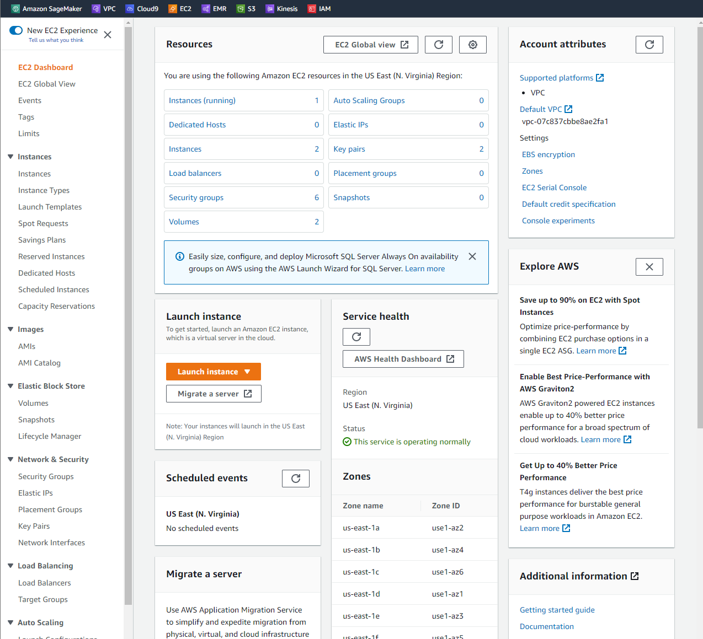

# AWS MongoDB Demo

## Purpose:
The purpose of this demo is to understand how to use MongoDB using AWS. 
First MongoDB is installed on an AWS EC2 instance of Ubuntu. Then create
an SSH tunnel to start interacting with the NoSQL database. I will document
all steps in this process for future implementations like a Flask app.

## Creating an AWS EC2 Instance

Log into AWS and navigate to the EC2 Dashboard.

Select the orange button "Launch Instance". This will bring you to the
launch instance setup menu.

The first step is naming your instance. You can name it whatever you like.

Then select an Application and OS Image. For this example select Ubuntu
and make sure you have the Free tier eligible version of the server. Use
the settings from the image below.

Next, instance type should be t2.micro of the Free tier eligible version.

This part is important if you want to use SSH tunneling to interact with
the database. Make sure you create a new key pair and save the file somewhere
secure.

You can use the defaults in the Network Settings and Configure Storage portions
of the forms and launch the instance.

## Access EC2 Instance through SSH

Now that you have created the EC2 instance you should see a green banner
stating that you have successfully initiated launch of instance along
with a random looking link. This link is your instance id. Go ahead and 
click it.

Clicking the link will bring you to the instance dashboard filtering only
the instance you just created. 

In this view make note that the Instance State is "Running" and the 
Status Check is "2/2 checks passed". If all is good then click the 
instance ID again.

From this view select 'Connect'. This will take you to methods for 
connecting to your EC2 instance. I'll be providing the commands to SSH 
into your instance so this window isn't providing you anything new
but, this window also provides you with the command and it is always good 
to know where you can find this information.

Now, we are ready to SSH into our EC2 instance. Windows 10 and 11 should 
come stock with an SSH client built into their command line same with
Mac. If you have an older Windows operating system I would use PuTTY 
from putty.org. 

## Installing MongoDB

## Adding Data to MongoDB from MongoDB Shell

Start by typing the mongosh command. This will open the MongoDB Shell. Data
used for this section is from a Kaggle dataset from here: https://www.kaggle.com/datasets/chicago/chicago-sidewalk-cafe-permits
Download the dataset and take a look at it. We will be using this data
to insert values into our database.

Create your database with the use database_name command. This will either
create or set this database as primary depending on whether it exists or
not.

    use MY_DATABASE

Then create a user account with the command below:

    db.createUser({
        user: "admin",
        pwd: "P@ssw0rd",
        roles: [
            {role : "readWrite", db : "MY_DATABASE" },
            {role : "userAdmin", db : "MY_DATABASE" },
            {role : "dbAdmin", db: "MY_DATABASE" },
        ]
    })

Next, create a collection called "sidewalk_cafe_permits". Collections are
NoSQL's version of tables. This is where we will store our permit data.

    db.createCollection("sidewalk_cafe_permits")

Now we will be inserting 1 document into our database to 
demonstrate the insertOne() command. For this example we will only use the 
first 9 columns. 

Just enter each entry individually.

    db.sidewalk_cafe_permits.insertOne(
        {
            permit_number:1142666,
            account:458934,
            site_number:1,
            legal_name:"TINTO & TAPAS, LLC",
            doing_business_as_name:"TINTO & TAPAS",
            issued_date:"2019-11-25T00:00:00.000",
            expiration_date:"2020-02-29T00:00:00.000",
            payment_date:"2019-10-29T00:00:00.000",
            address:"7958 W BELMONT AVE"
        }
    )

You should receive an acknowledgment after inserting a document.

Next we will use insertMany() 

    db.sidewalk_cafe_permits.insertMany([
        {
            permit_number:1142290,
            account:294900,
            site_number:4,
            legal_name:"PIE CAFE, LLC",
            doing_business_as_name:"Pie cafe",
            issued_date:"2019-10-15T00:00:00.000",
            expiration_date:"2020-02-29T00:00:00.000",
            payment_date:"2019-10-15T00:00:00.000",
            address:"5357 N ASHLAND AVE"
        },
        {
            permit_number:1142132,
            account:459163,
            site_number:1,
            legal_name:"KALIFLOWER 333 NORTH MICHIGAN AVE LLC",
            doing_business_as_name:"KALIFLOWER",
            issued_date:"2019-09-20T00:00:00.000",
            expiration_date:"2020-02-29T00:00:00.000",
            payment_date:"2019-09-20T00:00:00.000",
            address:"333 N MICHIGAN AVE"
        },
        {
            permit_number:1142101,
            account:384478,
            site_number:1,
            legal_name:"1732 N MILWAUKEE RESTAURANT LLC",
            doing_business_as_name:"SMALL CHEVAL",
            issued_date:"2019-09-20T00:00:00.000",
            expiration_date:"2020-02-29T00:00:00.000",
            payment_date:"2019-09-20T00:00:00.000",
            address:"1732 N MILWAUKEE AVE"
        },
        {
            permit_number:1142100,
            account:"456144",
            site_number:"1",
            legal_name:"THE WHALE CHICAGO, LLC",
            doing_business_as_name:"THE WHALE CHICAGO",
            issued_date:"2019-09-19T00:00:00.000",
            expiration_date:"2020-02-29T00:00:00.000",
            payment_date:"2019-09-19T00:00:00.000",
            address:"2427-2431 N MILWAUKEE AVE"
        }
    ])

Now, let's take a look at how many documents we have in our collection.

    db.sidewalk_cafe_permits.count()

Using find() will print off all documents in your collection.

    db.sidewalk_cafe_permits.find()

# Import CSV to MongoDB using mongoimport

Now that we have figured out how to import single and multiple entries 
let's import an entire CSV file to MongoDB. This method is great when you
want to transition from a relational database to a NoSQL database.

First we will want to use MY_DATABASE then create a new collection.

    use MY_DATABASE
    db.createCollection("earth_quakes")

Next we will use mongoimport to import our data from a CSV file into a 
MongoDB database

    mongoimport --db MY_DATABASE --collection earthquakes --type csv --headerline --file="C:/Users/kdenn/OneDrive/Documents/School/CS378_NoSQL Databases/catalog.csv"

